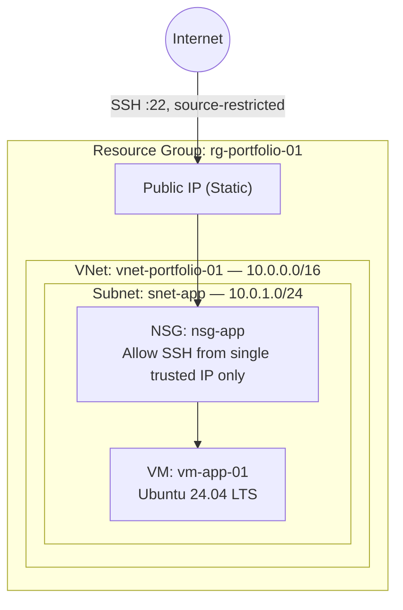

# Azure Secure Linux VM — Network Isolation Project

A hands-on Azure infrastructure project: a Linux VM deployed inside a segmented virtual network, with SSH access restricted to a single trusted IP via Network Security Group rules. Built and documented from scratch using the Azure Portal.

## Why this project

Most support/certification paths teach Azure concepts in isolation. This project was built to answer one question: **can I actually stand up a secure, working environment myself, end to end, and explain every decision in it?**

## Architecture

## Components

| Resource | Purpose |
|---|---|
| Resource Group | Logical container for all project resources; single point of teardown |
| Virtual Network (10.0.0.0/16) | Isolated private network for the deployment |
| Subnet (10.0.1.0/24) | Segmented address space for the application tier |
| Network Security Group | Stateful firewall — default-deny inbound, single allow rule for SSH from one IP/32 |
| Public IP | Entry point for management access |
| VM (Ubuntu 24.04 LTS) | Target compute resource |

## Key design decisions

**NSG on the subnet, not the NIC.** The security rule is attached at the subnet level rather than the individual network interface. Any additional VM placed in this subnet inherits the same restriction automatically — no per-VM security configuration to forget.

**No public inbound ports at VM creation.** Azure's VM wizard offers a shortcut to open SSH to all IPs at creation time. That option was declined; instead, access control is handled entirely by the NSG rule (source: my-IP/32, all other sources implicitly denied by the default DenyAllInBound rule).

**SSH key authentication, not password.** Eliminates brute-force password attacks as a vector entirely.

**Smallest viable compute size.** Sized for the workload (a single lightweight VM), not over-provisioned, keeping the environment inside free-tier / minimal-cost boundaries.

## Problems I ran into (and how I solved them)

Real Azure work rarely goes in a straight line. Documenting the friction here on purpose — this is the part a certification doesn't teach.

- **`NotAvailableForSubscription` on B-series VMs.** New Azure subscriptions carry default restrictions on certain VM families as an anti-abuse measure. Diagnosed by reading the exact Azure error code rather than assuming a quota problem, which pointed to a subscription-level restriction rather than something fixable by switching regions.
- **`QuotaExceeded` on B-series v2 after upgrading to Pay-As-You-Go.** Different failure mode, different fix: this one *is* a quota limit, requested through Usage + Quotas in the Azure Portal, approved within minutes.
- **Region/VNet mismatch.** A VNet and an NSG must live in the same region to be associated. Learned this by hitting "No results were found" when trying to associate a subnet across regions, and rebuilt the network in a single consistent region rather than patching around it.
- **Windows SSH key permissions.** Ubuntu's SSH client refuses to use a private key with overly-open file permissions. Fixed with `icacls` to restrict the key file to the current user only — and learned that external/removable drives can behave inconsistently with Windows ACLs, so the key was relocated to the system drive.

## What's next
- [x] Rebuild this same environment using Azure CLI — see [`deploy.sh`](./deploy.sh)
- [ ] Rebuild using Terraform (Infrastructure as Code)
- [ ] Add a budget/cost-alerting writeup
- [ ] Second project: multi-tier network (web + app subnets, NSG rules between tiers)

## Tech stack

`Azure Virtual Machines` `Virtual Network` `Network Security Groups` `Ubuntu 24.04 LTS` `SSH`

---

*Built as part of a self-directed transition from IT support into cloud/infrastructure engineering.*
